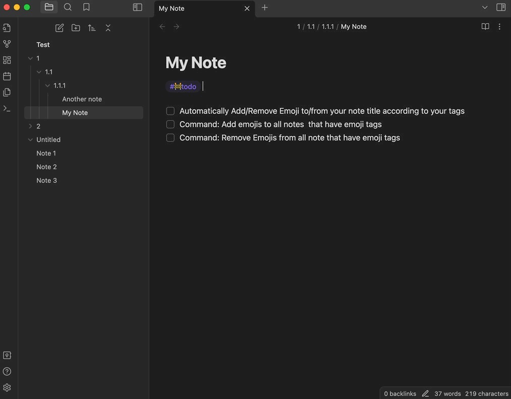
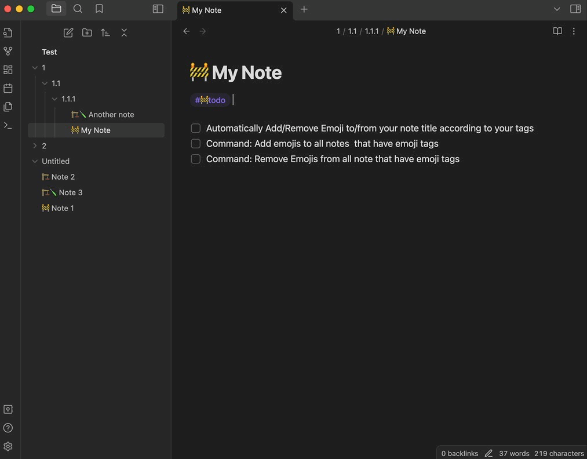

# EmoTagsTitler 
Add emoji to the title of notes with emoji tags. 
If you find this helpful, please buy me a coffee.

**Dropbox does not like emojis, any files with emojis in 
its name won't be synced.** 

## Add/Remove Emoji in your note tags to the title 

## Command Palette
### Add Emoji to all notes that have emoji tags 

### Remove Emoji from all notes that have emoji tags

